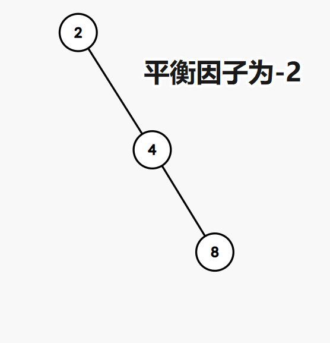
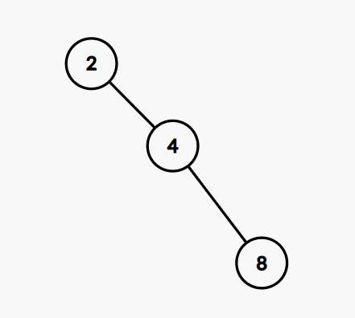

# 利用平衡二叉树实现一个动态查找表

[TOC]

## 学习二叉树的基本的知识

### 一些基本的概念

这里主要看了B站大佬的视频[平衡二叉树(AVL树)_bilibili](https://www.bilibili.com/video/BV1tZ421q72h)

1. 所有结点的(左子树高度-右子树高度)的绝对值=1，
2. 其中左子树高度-右子树高度的差值作为**平衡因子**
3. 平衡因子只有-1,0,1三种取值
4. 查找，插入，构建，删除的过程和二叉搜索树一致**只是失衡的时候需要调整**

### 插入时AVL是如何从失衡转为平衡的呢

基本的操作就是**左旋**和**右旋**

#### 左旋

从二叉搜索树的规则来看这两个的中序遍历都是一样的，但是第二个图的树高降低也就更加均匀了

**冲突的左孩子变成右孩子**

#### 右旋

右旋跟左旋基本一样，但是右旋冲突的右孩子变成左孩子

## 插入具体情况具体分析

### LL

1. 发生在根节点**左**孩子的**左**子树
2. 特点是**失衡节点**的平衡因子是**2**，失衡节点的**左孩子**的平衡因子是1
3. 操作就是对**失衡节点进行右旋**

### RR

1. 发生在根节点**右**孩子的**右**子树
2. 特点是**失衡节点**的平衡因子是**-2**，失衡节点的**右孩子**的平衡因子是-1
3. 操作就是对**失衡节点进行左旋**

### LR

1. 发生在根节点**左**孩子的**右**子树
2. 特点是**失衡节点**的平衡因子是**2**，失衡节点的**左孩子**的平衡因子是-1
3. 操作就是对**左旋左孩子然后右旋**

### RL 

1. 发生在根节点**右**孩子的**左**子树
2. 特点是**失衡节点**的平衡因子是**-2**，失衡节点的**右孩子**的平衡因子是1
3. 操作就是对**右旋右孩子然后左旋**

### 多个节点同时失衡

若多个祖先同时失衡的话，调整距离新插入的节点最近的那一个就行

### 总结

* 如果祖先节点的平衡因子是+2则为LX型
* 如果祖先节点的平衡因子是-2则为RX型
* 如果该节点的孩子节点的平衡因子是+1则为XL型
* 如果该节点的孩子节点的平衡因子是-1则为XR型

#### 说人话

1. 在左子树插入，`parent`平衡因子++
2. 在右子树插入，`parent`平衡因子--
3. 更新后`parent`平衡因子==0，说明`parent`所在的子树高度不变，不会再影响祖先，不用再继续沿着到root的路径往上更新
4. 新后`parent`平衡因子==1or-1，说明`parent`所在的子树的高度变化，会再影响祖先，需要继续沿着到`root`的路径往上更新
5. 新后`parent`平衡因子==2 or-2，说明`parent`所在的子树的高度变化且不平衡，对`parent`所在子树进行旋转，让他平衡
6. 更新到根节点

## 删除的情况

删除可能不止需要调整一次是的失衡状态，需要沿着祖先依次调整

# 具体操作

## 插入操作

总体来说：按照二叉搜索树的操作逻辑来正常插入，只不过后边要加上一个判断是否失衡的逻辑

1. 先写出二叉搜索树的基本插入逻辑
2. 更新平衡因子
   1. 如果更新后的平衡因子变成了0，则从这个节点开始不会影响到祖先节点了
   2. 如果平衡因子是1或者-1，接着往上更新
   3. 如果平衡因子是2或者-2，说明节点已经失衡进入到下一步的旋转操作部分，
   4. 如果不是上文提到的五种情况说明大逻辑出现了问题，直接抛异常

## 旋转操作部分

### 左旋部分

这里我的函数名称为`RotateL(Node* parent)`，传入的参数是失衡的节点
通过失衡的节点的指针可以访问到这个节点的父亲和右孩子，基本逻辑通了就到了实现的部分

失衡节点叫做parent 右孩子叫做cur 失衡节点的父节点叫做pparent，右孩子的左孩子叫做curleft

1. 冲突的左孩子变成右孩子
2. parent变成cur的左孩子
3. 左孩子的父节点变成parent
4. 处理cur和pparent的关系
5. 更新平衡节点

